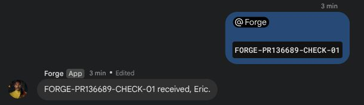

# PR136689: real Google Chat delivery proof

Observed2026-09-09 23:02CDT /2026-09-10 04:02UTC. Human test: `FORGE-PR136689-CHECK-01`. Final: `FORGE-PR136689-CHECK-01 received, Eric.` The human also confirmed correct visible behavior.

## What was tested

The exact `normalizeGoogleChatReplyTarget` helper from PR head `937da19775fee3236cf6c89385b63c16691d8cef` was extracted from committed `extensions/googlechat/src/monitor.ts`, with TypeScript annotations removed for the installed JavaScript bundle. Both durable planning and live delivery invoke it with the inbound message name and authoritative thread name, matching the PR. See [extracted helper](pr-helper.ts).

This was a controlled transplant into OpenClaw2026.9.3, not a complete build of the PR branch. Existing metadata-only diagnostic wrappers remained installed. The prior custom normalizer was removed, including its whitespace trimming, missing-target fallback, and reply-mode gating. Therefore the live test exercises the PR's exact-equality normalization behavior. Installed candidate SHA256: `9f1848577d53df399ac91bfaf27316883e611106f4d0430f165ed02606949433`. Original working bundle was preserved for rollback, activation/restart explicitly approved, and candidate hash/process rechecked after the exchange.

Candidate syntax plus14 replay checks passed using real reply construction and installed adapter HTTP-body construction with mocked network. Coverage includes three captured failures, no-placeholder durable delivery, multi-chunk replies,404 fallback,500 propagation, explicit alternate targets, absent/blank targets, off mode, no-current-reply intent, missing inbound thread, unrelated message ID, and provider canonical-thread continuity. These replay checks supplement the live test; they are not a fresh run of the PR's entire source test suite.

## Live result

[Platform message records](platform-proof.json) were independently fetched read-only using Google Chat `spaces.messages.get`; each returned HTTP200. Human and final bot message share the same thread. Human createTime04:02:09.914543Z; final update04:02:24.685119Z:14.770576 seconds.

[Gateway trace](delivery-trace.jsonl) shows:

1. Authenticated inbound source message `spaces/SPACE/messages/THREAD.HUMAN` in `spaces/SPACE/threads/THREAD`.
2. One typing POST creates `spaces/SPACE/messages/THREAD.BOT` in that thread.
3. Normalization receives the source message resource; direct delivery receives the corresponding thread resource.
4. One successful PATCH updates that exact bot message. No DELETE or replacement POST occurs in this exchange.

Actual resource identifiers are consistently replaced with readable placeholders; timestamps, operation relationships and test text are retained. No credentials, account email, private URLs or session IDs are included. API trace success records do not themselves contain numeric HTTP statuses; the HTTP200 values above come from independent messages.get reads.

## Visual evidence

The screenshot below is a direct browser capture cropped to the new test exchange, excluding account chrome and unrelated earlier tests. It shows the final reply marked Edited. It was captured after completion, not during the typing phase; the POST/PATCH lifecycle is proven by the correlated trace. Original full before/after captures remain retained privately.

This establishes the normal threaded live path. Disabled/failed typing and explicit retargeting cases have replay/source-test coverage, not separately claimed live tests. Maintainers may request a full-branch build if needed.
